# React 核心主线

本文档按「框架设计思想 → 核心数据结构 → 核心流程（含子流程） → 其他高频知识点 → 参考资料」梳理 React 18 的实现原理，只讲 React 本身，不涉及本项目的实现进度，每个知识点配一张 Mermaid 流程图，方便记忆和面试复述。

> **源码链接说明**：文中"源码"链接均指向 `facebook/react` 仓库 `v18.2.0` tag 下的真实文件（永久链接，不随主分支变动失效）。reconciler 内部核心算法文件（`ReactFiberBeginWork` / `ReactFiberWorkLoop` / `ReactFiberHooks` 等）在官方仓库中以 `.old.js` / `.new.js` 成对存在，这是 Facebook 内部 `www` 实验分支与 OSS 稳定分支共用一套代码的 fork 机制（详见 [scripts/rollup/inline-forks-plugin.js](https://github.com/facebook/react/blob/v18.2.0/scripts/rollup/inline-forks-plugin.js)），**npm 发布的稳定版实际编译进去的是 `.old.js`**，本文统一链接到该文件。

## 一、框架设计思想

### 1.1 分层架构：四层解耦

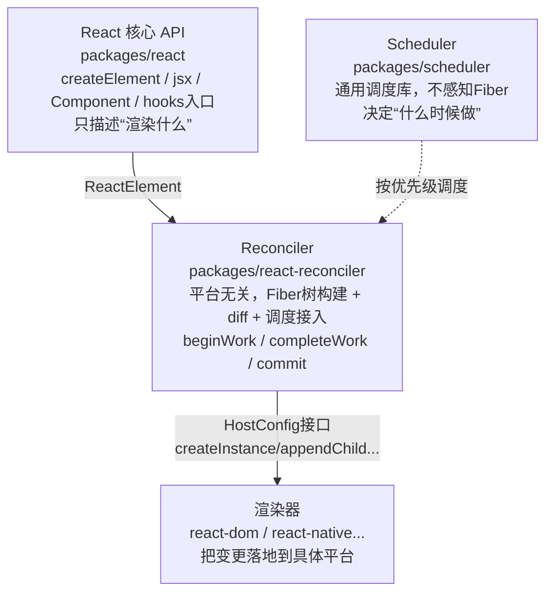

**为什么这样分层**：reconciler 与渲染器之间用 HostConfig 解耦 → 一套 diff 算法可以对接 DOM/Native/自定义渲染器；reconciler 与 scheduler 解耦 → 调度能力可以独立演进（甚至被其他项目复用），reconciler 只需要"lane → 优先级"的桥接。

### 1.2 虚拟 DOM 的本质

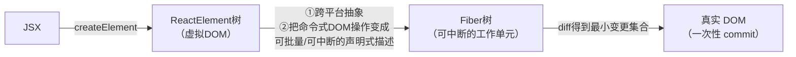

虚拟 DOM 不是为了"比原生快"，而是为了跨平台抽象和可中断的声明式描述。

### 1.3 render 阶段 vs commit 阶段

|          | render 阶段                              | commit 阶段                                      |
| -------- | ---------------------------------------- | ------------------------------------------------ |
| 做什么   | 构建 workInProgress Fiber 树，标记副作用 | 把副作用应用到真实 DOM                           |
| 能否中断 | 能（并发模式下可被打断，之后恢复或重来） | 不能（必须同步跑完，否则用户看到中间状态）       |
| 核心函数 | beginWork（递）/ completeWork（归）      | commitBeforeMutation/commitMutation/commitLayout |

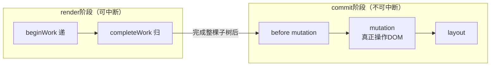

## 二、核心数据结构

### 2.1 ReactElement —— UI 的静态描述

```ts
{
  $$typeof: (REACT_ELEMENT_TYPE, type, key, ref, props);
}
```

由 `createElement`/`jsx` 产出的不可变普通对象（DEV 下 `Object.freeze`），只是"描述"不含实例状态，每次 render 都重新创建。

- 源码：[packages/react/src/ReactElement.js](https://github.com/facebook/react/blob/v18.2.0/packages/react/src/ReactElement.js)

### 2.2 Fiber —— 可中断工作单元 + 实例状态载体

```ts
FiberNode {
  tag, type, key, ref, props,     // 对应 ReactElement
  stateNode,                       // 真实实例：DOM节点/class实例/FiberRoot
  return, child, sibling,          // 树形指针（非数组，才能中断后精确恢复）
  alternate,                       // 指向双缓存树中对应的另一棵树的节点
  flags, subtreeFlags,             // 副作用标记：Placement/Update/Deletion...
  memoizedState,                   // 函数组件=Hook链表，class组件=this.state
  updateQueue,                     // 待处理更新队列
  lanes, childLanes,                // 本节点/子树的优先级
}
```

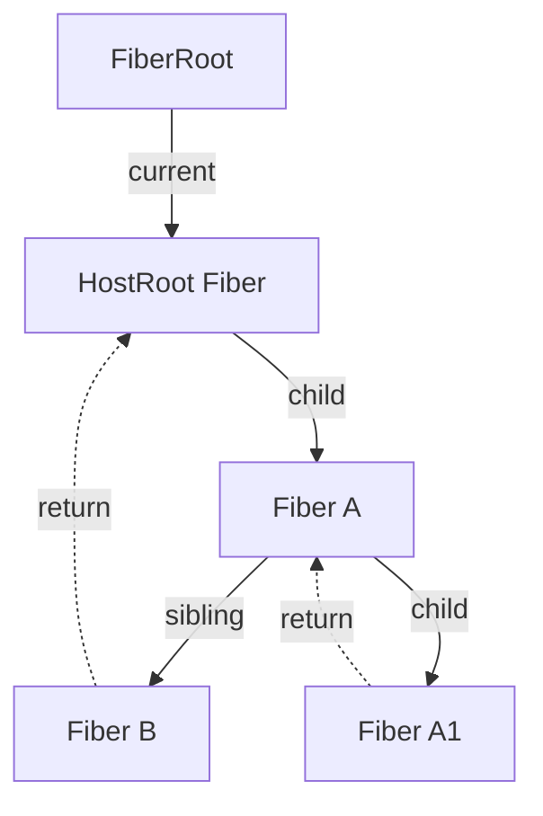

**为什么用链表而非递归**：Stack Reconciler 递归遍历树一旦开始无法中断（JS 调用栈无法从中间恢复）。Fiber 用 child/sibling/return 链表模拟调用栈，把"处理进度"存在节点上，可以随时中断、把控制权交还浏览器，之后再从中断点继续——这是"时间切片"的前提。

**Fiber 的 tag 分类清单**（`fiber.tag`，用于 beginWork/completeWork 内按类型分发）：

| tag 值 | 常量名                 | 含义                                        |
| ------ | ---------------------- | ------------------------------------------- |
| 0      | FunctionComponent      | 函数组件                                    |
| 1      | ClassComponent         | class 组件                                  |
| 2      | IndeterminateComponent | 初次渲染时尚未确定是函数组件还是 class 组件 |
| 3      | HostRoot               | fiber树的根节点（对应 FiberRoot.current）   |
| 4      | HostPortal             | createPortal 产生的节点                     |
| 5      | HostComponent          | 原生 DOM 标签（div/span...）                |
| 6      | HostText               | 文本节点                                    |
| 7      | Fragment               | `<></>`                                     |
| 9      | ContextConsumer        | `Context.Consumer` / useContext             |
| 10     | ContextProvider        | `Context.Provider`                          |
| 11     | ForwardRef             | `React.forwardRef` 包裹的组件               |
| 12     | Profiler               | `<Profiler>`                                |
| 13     | SuspenseComponent      | `<Suspense>`                                |
| 14     | MemoComponent          | `React.memo` 包裹的组件                     |
| 16     | LazyComponent          | `React.lazy` 包裹的组件                     |
| 22     | OffscreenComponent     | Suspense/隐藏树场景下用于保留卸载子树状态   |

- 源码：[packages/react-reconciler/src/ReactFiber.old.js](https://github.com/facebook/react/blob/v18.2.0/packages/react-reconciler/src/ReactFiber.old.js)（FiberNode 构造函数 / createFiber）
- 源码：[packages/react-reconciler/src/ReactWorkTags.js](https://github.com/facebook/react/blob/v18.2.0/packages/react-reconciler/src/ReactWorkTags.js)（完整 tag 常量定义）
- 延伸阅读：[《React技术揭秘》Fiber架构的工作原理](https://react.iamkasong.com/process/doubleBuffer.html)

### 2.3 双缓存树（current / workInProgress）

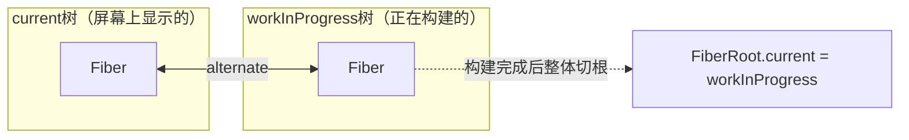

两棵树通过 `alternate` 指针互相引用，构建完成后直接切换根指针，而不是逐节点替换 DOM——即使渲染中途出错也不会影响已显示的内容。

- 源码：[packages/react-reconciler/src/ReactFiberRoot.old.js](https://github.com/facebook/react/blob/v18.2.0/packages/react-reconciler/src/ReactFiberRoot.old.js)（FiberRootNode）
- 延伸阅读：[《React技术揭秘》Fiber架构的工作原理——双缓存](https://react.iamkasong.com/process/doubleBuffer.html)（讲 current/workInProgress 通过 alternate 互连、mount/update 两阶段树的构建与替换）

### 2.4 Lane —— 优先级模型

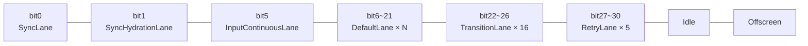

lanes 是 31 位二进制位，数值越小优先级越高，可用位运算合并/比较多个更新的优先级。一个 update 被分配到某个 lane，多个 update 可以合并处理（`mergeLanes`）；高优先级 lane 到来时可以打断正在进行的低优先级渲染。低优先级区段分配更多位数（如 TransitionLane 占 16 位），是因为低优先级更新更容易被打断积压，需要更多"批次"区分先后到达的更新。

- 源码：[packages/react-reconciler/src/ReactFiberLane.old.js](https://github.com/facebook/react/blob/v18.2.0/packages/react-reconciler/src/ReactFiberLane.old.js)
- 延伸阅读：[《React技术揭秘》lane模型](https://react.iamkasong.com/concurrent/lane.html)（赛道类比讲31位二进制表示优先级、"批"的概念及位运算操作）

### 2.5 UpdateQueue —— 更新队列

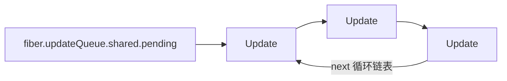

`enqueueUpdate` 把新 update 接入循环链表，`processUpdateQueue` 在 render 阶段按 lane 优先级依次消费、算出 `memoizedState`，跳过的低优先级 update 保留在 baseUpdate 链上等下次重新计算。

- 源码（class 组件）：[packages/react-reconciler/src/ReactFiberClassUpdateQueue.old.js](https://github.com/facebook/react/blob/v18.2.0/packages/react-reconciler/src/ReactFiberClassUpdateQueue.old.js)
- 源码（函数组件 Hook 队列）：[packages/react-reconciler/src/ReactFiberHooks.old.js](https://github.com/facebook/react/blob/v18.2.0/packages/react-reconciler/src/ReactFiberHooks.old.js)

## 三、核心流程

### 3.1 主链路总览

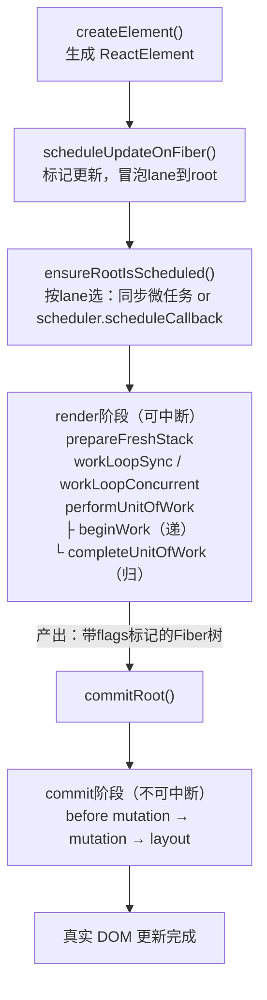

- 源码：[packages/react-reconciler/src/ReactFiberWorkLoop.old.js](https://github.com/facebook/react/blob/v18.2.0/packages/react-reconciler/src/ReactFiberWorkLoop.old.js)（scheduleUpdateOnFiber / ensureRootIsScheduled / workLoop 系列均在此文件）

### 3.2 子流程：beginWork（递）

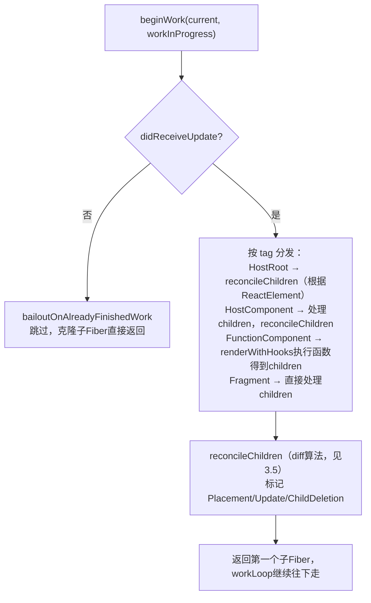

- 源码：[packages/react-reconciler/src/ReactFiberBeginWork.old.js](https://github.com/facebook/react/blob/v18.2.0/packages/react-reconciler/src/ReactFiberBeginWork.old.js)
- 延伸阅读：[《React技术揭秘》beginWork](https://react.iamkasong.com/process/beginWork.html)（mount/update分支判断、bailoutOnAlreadyFinishedWork、reconcileChildren入口）

### 3.3 子流程：completeWork（归）

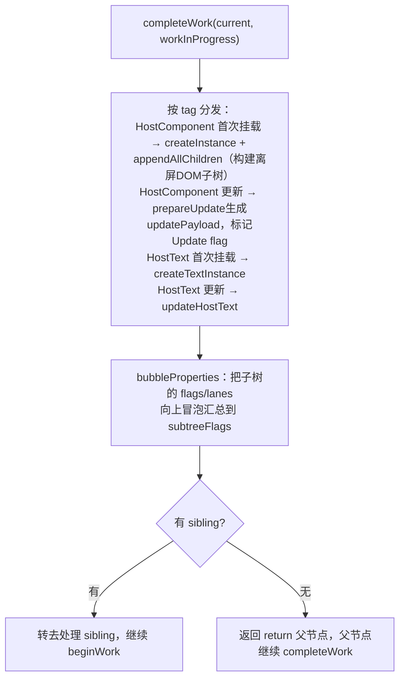

- 源码：[packages/react-reconciler/src/ReactFiberCompleteWork.old.js](https://github.com/facebook/react/blob/v18.2.0/packages/react-reconciler/src/ReactFiberCompleteWork.old.js)
- 延伸阅读：[《React技术揭秘》completeWork](https://react.iamkasong.com/process/completeWork.html)（HostComponent mount/update处理逻辑；注意该文讲的是老版本 effectList 链表，本项目及 React 18 现网版本已改为 subtreeFlags 向上冒泡汇总，两者作用等价，实现方式不同）

### 3.4 子流程：commit 三个子阶段

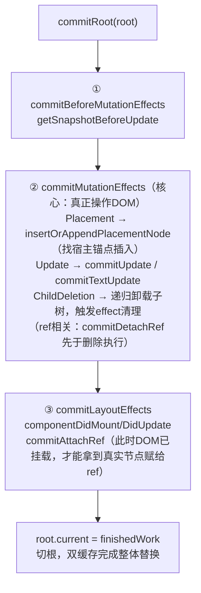

**ref 的处理时机**：ref 赋值（`commitAttachRef`）发生在 layout 子阶段，因为只有 mutation 阶段把 DOM 操作做完之后，才能拿到真实的 DOM 节点或组件实例；卸载时 `commitDetachRef` 则先于节点删除执行，避免 ref 指向一个已被移除的节点。`forwardRef` 把父组件传入的 ref 转发给内部某个子节点；`useImperativeHandle` 可以自定义暴露给外部 ref 的内容，而不是直接暴露 DOM 节点或组件实例本身。

- 源码：[packages/react-reconciler/src/ReactFiberCommitWork.old.js](https://github.com/facebook/react/blob/v18.2.0/packages/react-reconciler/src/ReactFiberCommitWork.old.js)
- 源码（forwardRef）：[packages/react/src/ReactForwardRef.js](https://github.com/facebook/react/blob/v18.2.0/packages/react/src/ReactForwardRef.js)
- 延伸阅读：[《React技术揭秘》commit阶段流程概览](https://react.iamkasong.com/renderer/prepare.html)（三个子阶段职责划分）

### 3.5 子流程：Diff 算法（reconcileChildren）

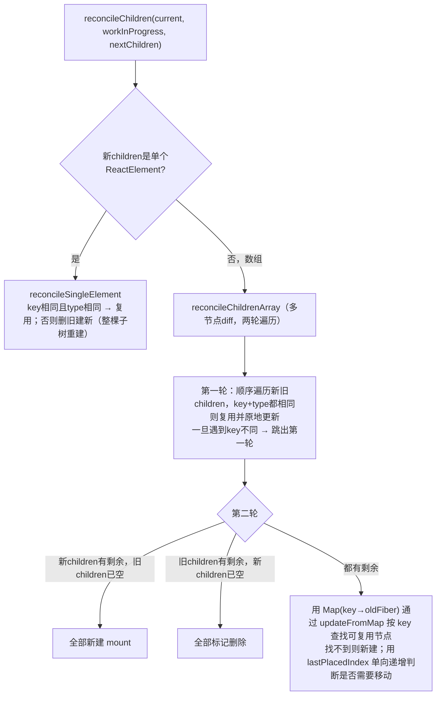

**为什么不建议用 index 当 key**：增删/排序场景下 index 会随位置变化，导致本该复用的节点被错误标记为需要更新/删错节点。

**`lastPlacedIndex` 单向判断的原理**：第二轮遍历时，对每个能复用的节点取出它在旧 children 中的位置索引 `oldIndex`。如果 `oldIndex < lastPlacedIndex`，说明这个节点在旧数组里排在"已处理过的最靠右节点"前面，现在却要出现在后面，只能是往右移动，标记 `Placement`；否则说明相对顺序没变，不标记，同时把 `lastPlacedIndex` 更新为 `oldIndex`（单向递增）。只标记右移不标记左移，是因为整个数组是从左到右遍历插入的，每次只需要判断"这个节点是否需要往后挪"，左边节点的位置会在后续插入时自然被挤对。

- 源码：[packages/react-reconciler/src/ReactChildFiber.old.js](https://github.com/facebook/react/blob/v18.2.0/packages/react-reconciler/src/ReactChildFiber.old.js)（reconcileChildFibers/mountChildFibers 底层实现，updateFromMap 也在此文件）
- 延伸阅读：[《React技术揭秘》多节点Diff](https://react.iamkasong.com/diff/multi.html)（两轮遍历、lastPlacedIndex移动判断的具体demo）

### 3.6 子流程：调度接入（Scheduler + Lane 桥接）

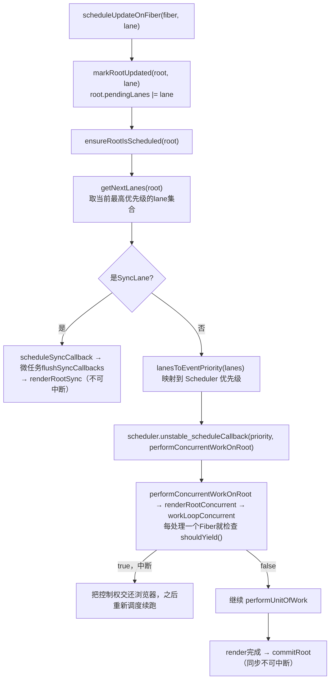

**中断后如何恢复**：不是恢复 JS 调用栈，而是保留 workInProgressRoot 上已完成的部分，重新调度后从 root 重新走一遍 `beginWork`（已完成且无更新的节点走 bailout 跳过，不重复计算）。

- 源码：[packages/react-reconciler/src/ReactFiberWorkLoop.old.js](https://github.com/facebook/react/blob/v18.2.0/packages/react-reconciler/src/ReactFiberWorkLoop.old.js)
- 源码（Scheduler 主循环）：[packages/scheduler/src/forks/Scheduler.js](https://github.com/facebook/react/blob/v18.2.0/packages/scheduler/src/forks/Scheduler.js)
- 源码（Scheduler 优先级常量）：[packages/scheduler/src/SchedulerPriorities.js](https://github.com/facebook/react/blob/v18.2.0/packages/scheduler/src/SchedulerPriorities.js)
- 延伸阅读：[《React技术揭秘》Scheduler的原理与实现](https://react.iamkasong.com/concurrent/scheduler.html)（MessageChannel优先于setTimeout、5ms时间片、taskQueue/timerQueue双堆结构）

## 四、其他高频知识点

### 4.1 Hooks 原理

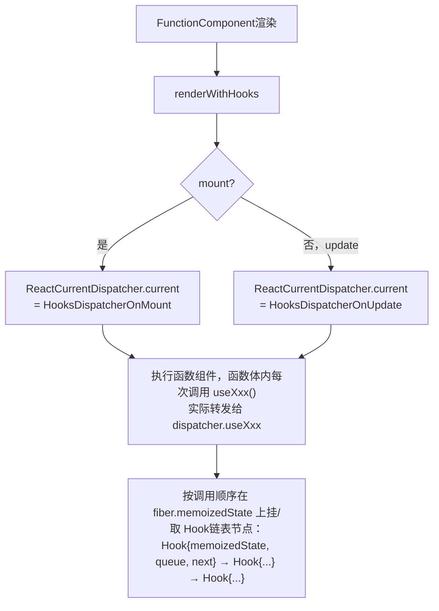

- 是"链表"：调用顺序必须稳定，因为 React 靠"第几次调用"而非变量名对应链表节点——这是不能在条件/循环中调用 Hooks 的根本原因
- `useEffect`（Passive，commit后异步执行，不阻塞绘制） vs `useLayoutEffect`（Layout，commit的layout子阶段同步执行，可读最新布局但会阻塞）
- `useMemo`/`useCallback` 用 `Object.is` 浅比较 deps，本质是"用空间换时间"
- 闭包陷阱：每次渲染都是全新函数调用和全新变量作用域，`useEffect` 里拿到的是创建那次渲染的 state 快照

**StrictMode 双调用机制**：开发模式下 `<StrictMode>` 会有意把函数组件本体、`useState`/`useReducer` 的初始化函数、部分生命周期函数**调用两次**（`useEffect` 则表现为 setup → cleanup → setup 的双周期）。目的是主动暴露不纯的副作用（如在渲染期间直接修改外部变量），帮助开发者提前发现将来在可中断渲染、组件状态复用等特性下会出问题的代码，只在开发环境生效，不影响生产构建。

**useId 的用途**：用于生成跨 SSR/CSR 一致的唯一 id（比如表单 label 和 input 关联），因为组件树的挂载顺序在服务端和客户端是确定且一致的，不能像 `Math.random()` 那样在两端生成不同的值导致 hydration 不匹配。

- 源码：[packages/react-reconciler/src/ReactFiberHooks.old.js](https://github.com/facebook/react/blob/v18.2.0/packages/react-reconciler/src/ReactFiberHooks.old.js)
- 延伸阅读：[《React技术揭秘》Hooks数据结构](https://react.iamkasong.com/hooks/structure.html)（mount/update双dispatcher切换依据、Hook节点字段）
- 延伸阅读：[React 官方文档 `<StrictMode>`](https://react.dev/reference/react/StrictMode)（双调用机制的官方说明）

### 4.2 批处理与并发特性（React 18 新增）

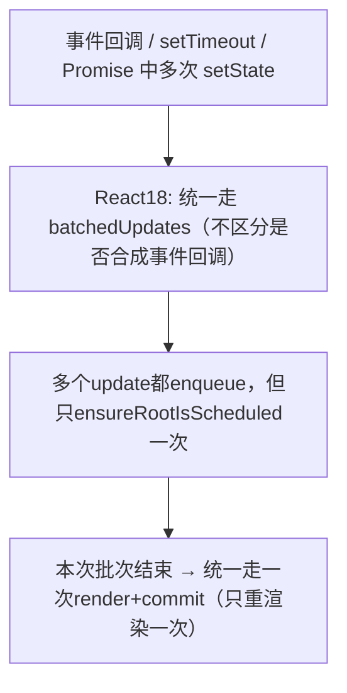

- `useTransition`/`useDeferredValue`：本质是给这次更新分配一个更低优先级的 TransitionLane，不是"延迟执行"而是"允许被高优先级更新打断"
- `Suspense`：渲染中抛出 Promise（wakeable/thenable）→ 被最近的 Suspense 边界捕获（`ShouldCapture` 标志转为 `DidCapture`）→ 内部用 `OffscreenComponent` 包裹主内容并隐藏，同时保留其 Fiber 状态不销毁 → 显示 fallback → 通过 `pingCache` 给同一个 wakeable 注册去重的 ping 监听，避免重复注册多个 then 回调 → Promise resolve 后用 `retryLane` 触发这棵子树重新渲染（unwind流程）

**useSyncExternalStore 的引入背景**：并发渲染下，render 阶段可能被打断、恢复，也可能有多个组件在不同的时间点读取同一个外部 store（如 Redux/Zustand）。如果 store 的值在这些间隙发生了变化，会出现同一次渲染里不同组件看到不一致快照的"tearing"问题。`useSyncExternalStore` 通过在 commit 后做一次同步校验（发现快照不一致就强制同步重渲染）来保证一致性，是外部状态管理库适配 React 18 并发特性的标准方案。

- 源码（Suspense unwind）：[packages/react-reconciler/src/ReactFiberThrow.old.js](https://github.com/facebook/react/blob/v18.2.0/packages/react-reconciler/src/ReactFiberThrow.old.js)
- 延伸阅读：[React 官方文档 useTransition](https://react.dev/reference/react/useTransition) / [useDeferredValue](https://react.dev/reference/react/useDeferredValue)
- 延伸阅读：[jser.dev: How Suspense works internally in Concurrent Mode 1 - Reconciling flow](https://jser.dev/react/2022/04/02/suspense-in-concurrent-mode-1-reconciling/)（抛出Promise→ShouldCapture/DidCapture→Offscreen隐藏保留状态→ping/retry恢复渲染的完整机制）
- 延伸阅读：[React 18 Working Group: What is tearing?](https://github.com/reactwg/react-18/discussions/69)（useSyncExternalStore 要解决的 tearing 问题背景）

### 4.3 组件与生命周期

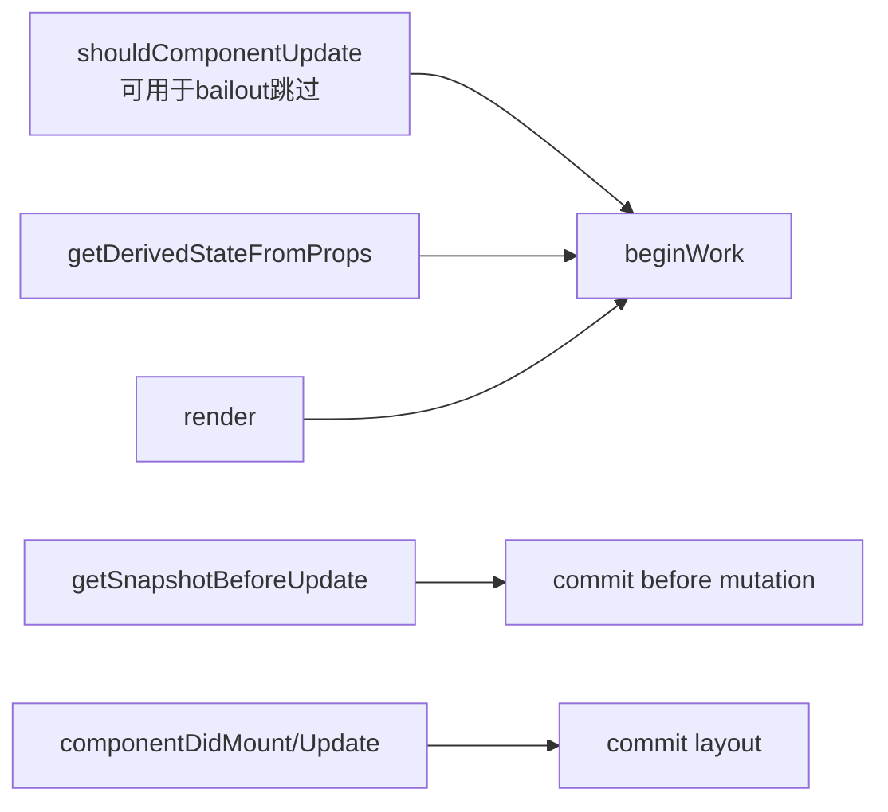

- `PureComponent`/`React.memo`：浅比较 props/state，等价于自动生成的 `shouldComponentUpdate`
- Error Boundary：`getDerivedStateFromError`/`componentDidCatch` 在 commit 阶段捕获渲染错误，**无法**捕获事件处理函数里的错误（那是普通 try/catch 的范畴）
- **常见误解**：`getDerivedStateFromProps` 在**每次** render 都会调用，不管是 mount 还是 update，也不管 props 是否真的变化，不是只在 props 变化时才触发——这是官方文档特意强调过的高频误区

- 源码：[packages/react-reconciler/src/ReactFiberClassUpdateQueue.old.js](https://github.com/facebook/react/blob/v18.2.0/packages/react-reconciler/src/ReactFiberClassUpdateQueue.old.js)
- 源码（memo）：[packages/react/src/ReactMemo.js](https://github.com/facebook/react/blob/v18.2.0/packages/react/src/ReactMemo.js)

### 4.4 Context 跨层通信

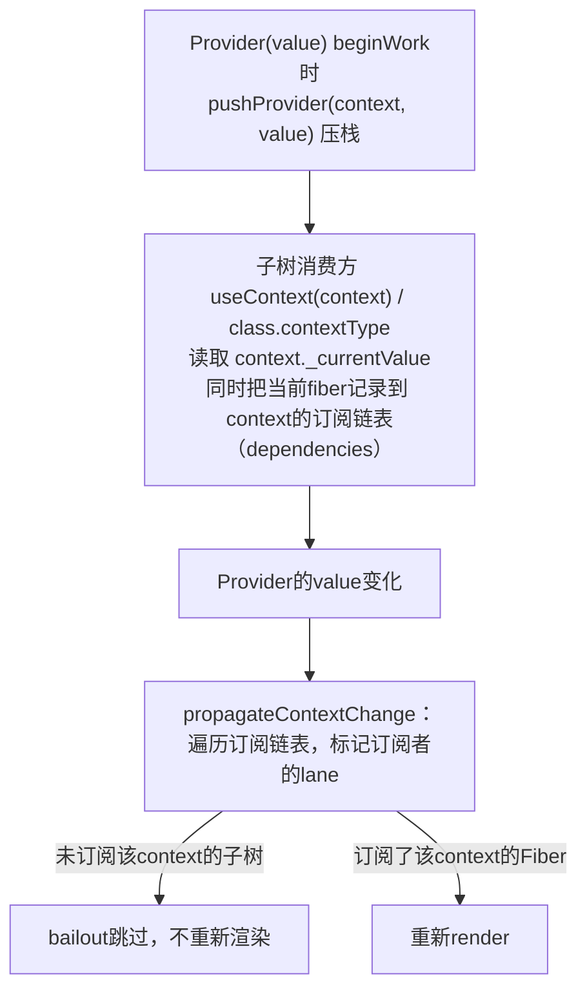

- 源码：[packages/react-reconciler/src/ReactFiberNewContext.old.js](https://github.com/facebook/react/blob/v18.2.0/packages/react-reconciler/src/ReactFiberNewContext.old.js)
- 延伸阅读：[react-illustration-series: React Context 原理](http://7km.top/main/context/)（pushProvider栈式管理_currentValue、propagateContextChange双向遍历标记lane）

### 4.5 事件系统

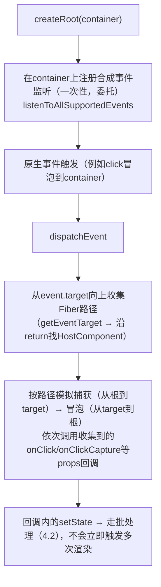

- 合成事件（SyntheticEvent）包装原生 event，抹平浏览器差异，同时和 Fiber 的优先级/批处理机制打通
- 事件委托：所有事件统一绑定在 root 容器上，而非每个 DOM 节点单独绑定，节省内存

- 源码：[packages/react-dom/src/events/DOMPluginEventSystem.js](https://github.com/facebook/react/blob/v18.2.0/packages/react-dom/src/events/DOMPluginEventSystem.js)
- 源码：[packages/react-dom/src/events/ReactDOMEventListener.js](https://github.com/facebook/react/blob/v18.2.0/packages/react-dom/src/events/ReactDOMEventListener.js)
- 延伸阅读：[react-illustration-series: React 合成事件](http://7km.top/main/synthetic-event/)（事件绑定到根容器、listenToAllSupportedEvents注册流程、SyntheticEvent封装）

## 五、参考资料

- React 官方仓库：https://github.com/facebook/react
- Fiber 架构设计文档（React 团队）：https://github.com/acdlite/react-fiber-architecture
- Big-React（卡颂）：https://github.com/BetaSu/big-react
- React技术揭秘（卡颂）：https://react.iamkasong.com/
- React 官方文档：https://react.dev/
- react-illustration-series（图解 React 源码系列）：http://7km.top/
- jser.dev（Suspense/Concurrent Mode 源码分析系列）：https://jser.dev/
- React 18 Working Group 讨论区：https://github.com/reactwg/react-18/discussions
